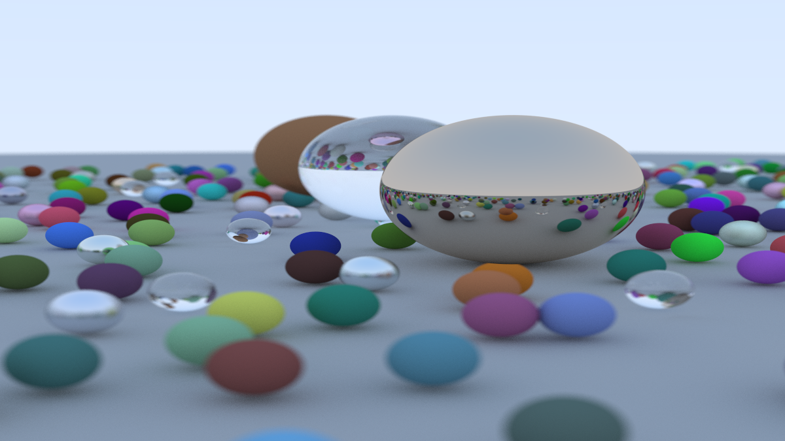

# Simple Ray Tracer in Rust

**VERY INCOMPLETE AND UNOPTIMISED RAY TRACER**

Based on the article [Ray Tracing in One Weekend](https://raytracing.github.io/books/RayTracingInOneWeekend.html) by Peter Shirley, Trevor David Black and Steve Hollasch.

## Result

## Inspiration

- [rust_tracer](https://github.com/AlDu2407/rust_tracer)